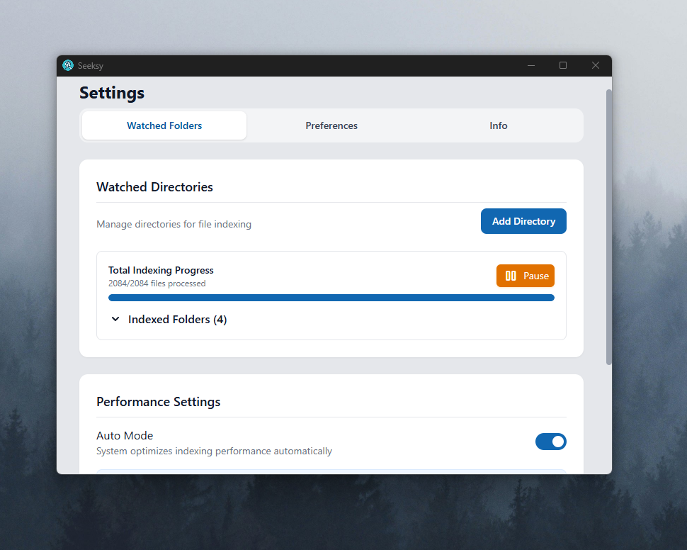

# 🔍 Seeksy Search

[](https://www.gnu.org/licenses/gpl-3.0)
[](https://nodejs.org)
[](https://vuejs.org/)
[](https://github.com/andreasjhagen/seeksy/actions/workflows/release.yml)

<p align="center">
  
</p>

A desktop search application, inspired by the macOS Spotlight, built with Electron and Vue. It offers fast file search, an application launcher and can also function as an emoji picker.

Runs seamlessly in the background, ready to open with **Ctrl + Space** (default shortcut). Fully customizable via the settings menu, accessible through the gear icon or the tray icon's context menu.


---

## ✨ Features

- 🔎 **Universal Search** - Search files, folders, applications and emoji from a single, invokable search interface
- 🖥️ **Multi-Platform Support** - Works on Windows and Linux
- ⌨️ **Keyboard Navigation** - Navigate search results with arrow keys
- 🎮 **App Launcher** - Auto-detects all applications and installed games (initial indexing may take a few minutes)
- 🚀 **Intelligent Indexing** - Fast background content indexing with adaptive performance optimization
- ⭐ **Favorites System** - Mark frequently used items as favorites for quick access
- 🎨 **Customizable Settings** - Choose between dark/light mode, accent colors, and configurable search shortcut (default: Ctrl + Space)

## 🖼️ Screenshots

|                                       Custom Themes and Settings                                        |                  Smart Folder Management                  |
| :-----------------------------------------------------------------------------------------------------: | :-------------------------------------------------------: |
|                                                   |         |
| Personalize Seeksy with themes, custom keyboard shortcuts, and search preferences to suit your workflow | Control what gets indexed to keep search results relevant |

|                 Application Search                  |                  Emoji Picker                   |
| :-------------------------------------------------: | :---------------------------------------------: |
|  |  |
|     Find and launch all installed applications      |    Copies emoji directly into your clipboard    |

## 🛠️ Technical Stack

| Category | Technologies                |
| -------- | --------------------------- |
| Frontend | Vue 3, Vue Router, Pinia    |
| UI       | Tailwind CSS v4, HeadlessUI |
| Backend  | Electron                    |
| Storage  | SQLite, electron-store      |

## 💻️ Development Setup

### Prerequisites

- Node.js 16+
- npm, yarn or pnpm

### Installation

```bash
# Install dependencies
npm install

# Start development server
npm run dev

# Start with file watching
npm run dev:watch
```

### Building

```bash
# Windows installer
npm run build:win

# Linux packages (AppImage, deb)
npm run build:linux
```

## 🤝 Contributing

1. Fork the repository
2. Create your feature branch (`git checkout -b feature/amazing-feature`)
3. Commit your changes (`git commit -m 'Add some amazing feature'`)
4. Push to the branch (`git push origin feature/amazing-feature`)
5. Open a Pull Request

## 📄 License

This project is licensed under the GNU General Public License v3.0 (GPL-3.0).

| **Permission**        | **Condition**                   | **Limitation**  |
| --------------------- | ------------------------------- | --------------- |
| ✅ **Commercial Use** | 📋 Must remain open source      | ❌ No liability |
| ✅ **Distribution**   | 📋 Must use the same license    | ❌ No warranty  |
| ✅ **Modification**   | 📋 Must disclose source changes |                 |
| ✅ **Private Use**    |                                 |                 |

For more details, see [GNU GPL v3.0](https://www.gnu.org/licenses/gpl-3.0.en.html)

Wallpaper Credit: [Paul Pastourmatzis](https://unsplash.com/de/fotos/silhouette-von-baumen-die-in-nebel-gehullt-sind-KT3WlrL_bsg)
